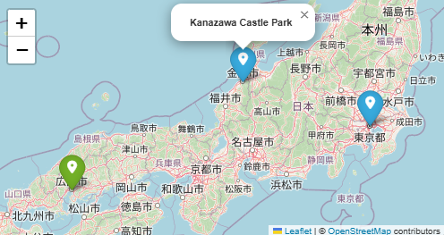

# PyMapify
[](https://github.com/GreenMachine582/pymapify/actions/workflows/project_tests.yml)


[](https://github.com/GreenMachine582/pymapify/compare/v1.0.0...dev?include_prereleases)

## Table of Contents
- [Introduction](#introduction)
- [Key Features](#key-features)
- [Testing](#testing)
- [License](#license)

---

## Introduction
This Python project aims to transform a CSV file containing Google Maps links into an interactive map. It extracts the destinations' geographic coordinates from the links and plots them on an interactive map using visualisation libraries like Folium. The map allows users to explore their destinations, view details, and save the map as an HTML file for sharing or further analysis.

## Key Features
* Parse Google Maps links to extract latitude and longitude.
* Read and process CSV files containing destination data.
* Create interactive maps with markers for each destination.
* Save maps as HTML for easy sharing or embedding.
* Store data in a persistent database.
* Optional customisation for marker icons.



## Testing
PyMapify includes a comprehensive suite of unit tests to ensure the reliability and stability of its features. Tests cover various aspects of the core functionality.

### Running Tests
To run the tests, navigate to the project root directory and execute the following command:

```bash
python -m unittest discover -s tests
```

## License
PyMapify is licensed under the MIT License, see [LICENSE](LICENSE) for more information.